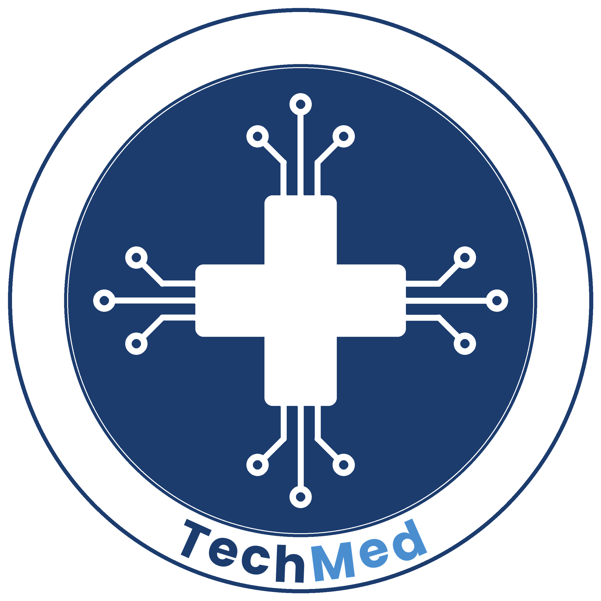

# TechMed

TechMed

An accessible, AI-powered symptom checker to help patients understand their health concerns.

TechMed is an accessible, AI-powered symptom-checking application that helps patients better understand their health concerns. TechMed guides users to describe, analyze, and understand their symptoms end-to-end, producing clear insights they can discuss with a healthcare provider.

TechMed is built for patients and caregivers who want:

Accessible health guidance - check symptoms easily, anytime, anywhere
Clear, understandable insights - less confusion, more actionable next steps
Better-informed conversations - arrive at appointments already understanding your concerns

Getting Started

Quickstart: https://github.com/Shiva-Deh/TechMed#getting-started
Docs: https://github.com/Shiva-Deh/TechMed/wiki
Repository: https://github.com/Shiva-Deh/TechMed

Support & Community

GitHub Issues: https://github.com/Shiva-Deh/TechMed/issues
Email: yutechmed@gmail.com

Show Image
Show Image

Contributing

We welcome contributions - bugs, features, docs, and ideas.

Report bugs / request features: https://github.com/Shiva-Deh/TechMed/issues
Open a pull request: https://github.com/Shiva-Deh/TechMed/pulls

Contact

Email: yutechmed@gmail.com
